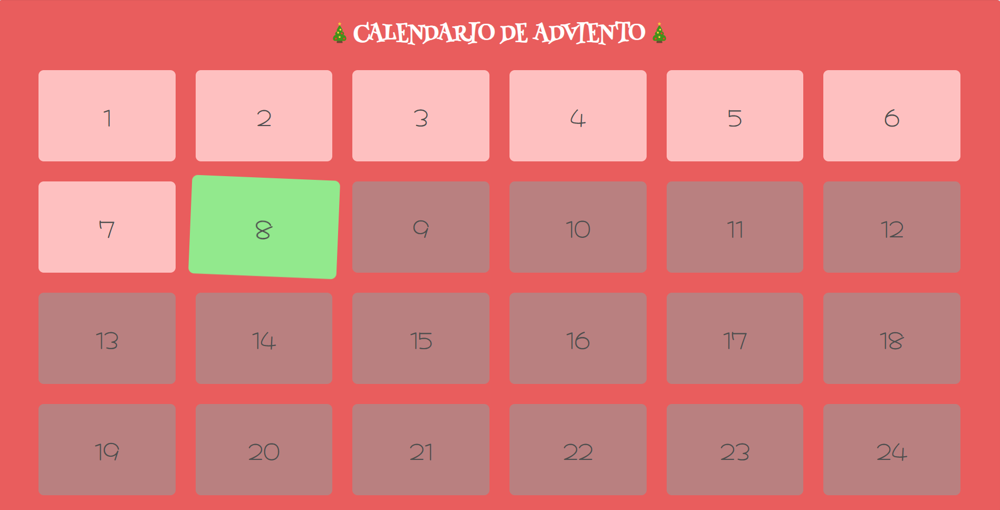
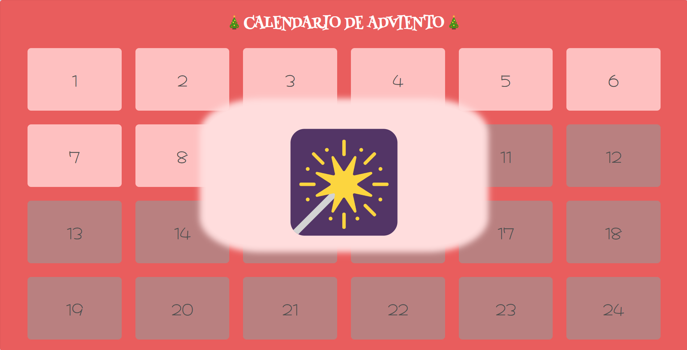

# Calendario De Adviento




## Descripción

Este es un pequeño proyecto que he diseñado con fines de entretenimiento. Es un simple Calendario De Adviento en el que se muestran los días que quedan para Navidad y cada día que entras te encontrarás con un pequeño regalo.

## Lenguajes utilizados

Este es un proyecto con solo front-end y los lenguajes de programación son los siguientes:

 * HTML
 * CSS
 * JavaScript
## Instalación y uso

Este proyecto no requiere de comandos para inicializar. Solo se necesita clonar el repositorio.

```bash
  git clone https://github.com/MilimNava-dev/christmas-project.git calendario-de-adviento
```
    
## Contribuciones

No he detectado ningún error en la programación de la web, pero si encuentras alguno, ¡por favor házmelo saber!

Las contribuciones, recomendaciones y mejoras siempre son bienvenidas.	

**IMPORTANTE:** Aunque la página web esté en Español, el código está escrito en inglés. Con esto me refiero a que en vez de escribir como título de una función: `crearCasillas` la he llamado `createBoxes`
## Colores
Como es un calendario de Adviento he querido utilizar colores navideños como rojo, verde y blanco, entre algunas variaciones.
| Colores             | Hex                                                                |
| ----------------- | ------------------------------------------------------------------ |
| `--main-bg-color` |  #E95D5D |
|  `--not-avalible` |  #B98080 |
| `--box-color` |  #FEC0C0 |
| `--today-color` |  #92E98D |


## API Utilizadas
En este proyecto he utilizado dos fuentes sacadas de la API de Google: [Google Fonts](https://fonts.google.com/).
* [Hachi Maru Pop](https://fonts.google.com/specimen/Hachi+Maru+Pop) → Números
* [Henny Penny](https://fonts.google.com/specimen/Henny+Penny) → Título

Las fuentes han sido insertadas en el CSS con el `@import`
```
@import url('https://fonts.googleapis.com/css2?family=Hachi+Maru+Pop&family=Henny+Penny&display=swap');

```
## Sobre mí
Soy una programadora autodidacta principiante. Este es de mis primeros proyectos después de aprender a programar, así que seguramente que mi código no es el ideal y tenga mucho margen de mejora, así que si alguien se da cuenta de algo siempre estoy abierta a feedback.

También tengo que decir que es probable que haya faltas de ortografía, ya que el inglés no es mi lengua materna.

¡Gracias!